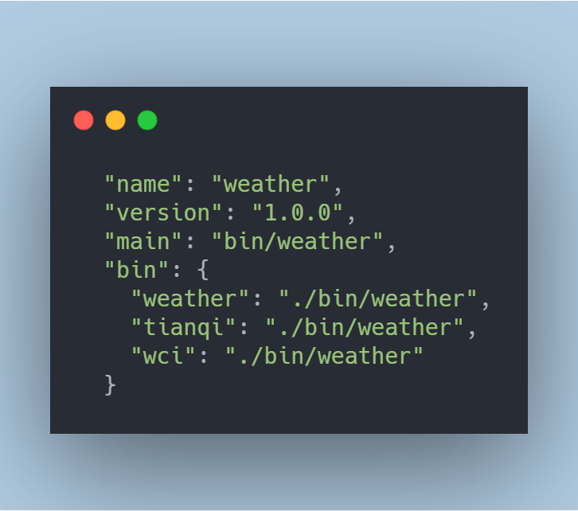
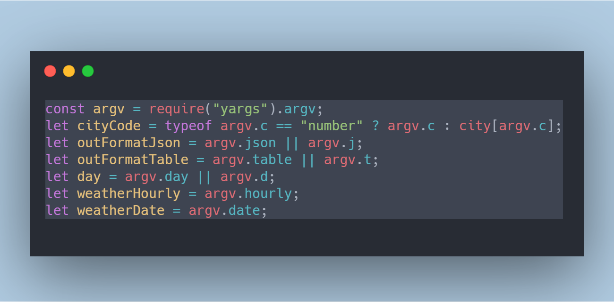
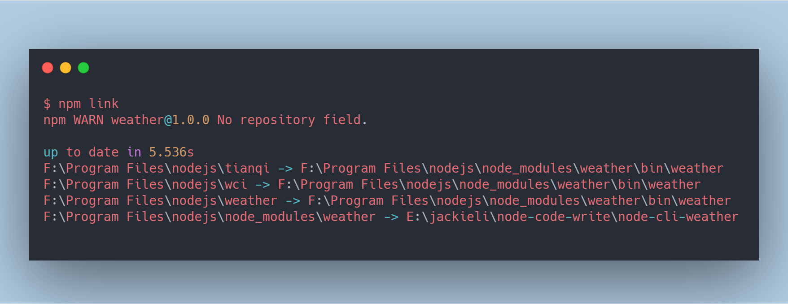

title: Node命令行(CLI)工具开发
speaker: jackieli
plugins:
    - echarts
url: https://github.com/ksky521/nodeppt
js:
    - background.js
<slide class="bg-apple aligncenter" image="http://static.lilidong.cn/bg.jpg .dark">

:::{.aligncenter}

# Node命令行(CLI)工具开发 {.text-subtitle.animated.fadeIn}

:::

:::footer
&emsp; {.alignleft}

[:fa-github: jackieli](https://github.com/jackieli123723){.alignright}

:::

:::header
&emsp; {.alignright}
:::

<slide class="bg-apple aligncenter" >

#### Node命令行(CLI)工具开发 {.text-subtitle.animated.fadeInDown.delay-100}
- CLI是什么？{.text-subtitle.animated.fadeInDown.delay-300}
- CLI工具的应用 {.text-subtitle.animated.fadeInDown.delay-400}
- CLI开发的模块介绍 {.text-subtitle.animated.fadeInDown.delay-500}
- CLI数据交互和爬虫数据抓取 {.text-subtitle.animated.fadeInDown.delay-600}
- Node 写 CLI 基本步骤 {.text-subtitle.animated.fadeInDown.delay-700}
- 总结和Q&A  {.text-subtitle.animated.fadeInDown.delay-800}

<slide class=" bg-apple fullscreen"> {.bg-apple}

:::card

---

## CLI是什么？

 
命令行界面（英语：Command-Line Interface，缩写：CLI）是在图形用户界面得到普及之前使用最为广泛的用户界面，它通常不支持鼠标，用户通过键盘输入指令，计算机接收到指令后，予以执行。也有人称之为字符用户界面（character user interface, CUI）。

通常认为，命令行界面（CLI）没有图形用户界面（GUI）那么方便用户操作。因为，命令行界面的软件通常需要用户记忆操作的命令，但是，由于其本身的特点，命令行界面要较图形用户界面节约计算机系统的资源。在熟记命令的前提下，使用命令行界面往往要较使用图形用户界面的操作速度要快。所以，在现在的图形用户界面的操作系统中，通常都保留着可选的命令行界面。 {.bg-apple.animated.fadeInLeft.delay-300}

:::

<slide class="bg-apple aligncenter" >

#### CLI工具的应用&emsp;&emsp;&emsp;&emsp;{.text-subtitle.animated.fadeInDown.delay-300}

- 系统命令：cd、mkdir、ifconfig {.text-lowercase.text-subtitle.animated.fadeInUp.delay-300}
- 脚手架工具：create-react-app、@vue/cli、@angular/cli! {.text-lowercase.text-subtitle.animated.fadeInUp.delay-400}
- 预处理器：less、sass、babel{.text-lowercase.text-subtitle.animated.fadeInUp.delay-500}
- 测试工具：mocha、karma!、jest{.text-lowercase.text-subtitle.animated.fadeInUp.delay-600}
- 构建工具：webpack!、gulp、rollup、ts-node{.text-lowercase.text-subtitle.animated.fadeInUp.delay-700}
- 可以全局安装的npm包几乎都是CLI{.text-lowercase.text-subtitle.animated.fadeInUp.delay-800}

<slide class="bg-apple aligncenter" >

#### CLI开发的常用模块介绍 {.animated.tada}

-  **commander** 注册、解析命令行参数  !{.text-lowercase.text-subtitle.animated.fadeInUp.delay-300}
-  **colors** 输出流颜色  !{.text-lowercase.text-subtitle.animated.fadeInUp.delay-400}
-  **yargs** 解析传递参数  !{.text-lowercase.text-subtitle.animated.fadeInUp.delay-500}
-  **cheerio** 抓取接口数据或者网页的源代码 [:fa-github-alt:](https://www.npmjs.com/package/cheerio){.text-lowercase.text-subtitle.animated.fadeInUp.delay-600}
-  **axios** 抓取接口数据或者网页的源代码  !{.text-lowercase.text-subtitle.animated.fadeInUp.delay-700}
-  **request** 可以用代理抓取接口 [:fa-github-alt:](https://www.npmjs.com/package/request){.text-lowercase.text-subtitle.animated.fadeInUp.delay-800}

<slide class="bg-apple aligncenter" >

#### CLI数据交互和爬虫数据抓取{.text-subtitle.animated.fadeInDown.delay-300}

`cli` 工具的数据来源[新版中国天气网](http://www.weather.com.cn/weather1dn/101010100.shtml){.text-lowercase.text-subtitle.animated.fadeInUp.delay-300}

- 抓包分析{.text-lowercase.text-subtitle.animated.fadeInUp.delay-400}
- 异步js加载的执行分析 {.text-lowercase.text-subtitle.animated.fadeInUp.delay-500}
- 反爬虫数据策略的处理 {.text-lowercase.text-subtitle.animated.fadeInUp.delay-600}
- 数据来源处理DA聚合{.text-lowercase.text-subtitle.animated.fadeInUp.delay-700}

<slide class="bg-apple aligncenter" >

#### 抓包分析{.text-subtitle.animated.fadeInDown.delay-300}

 !{.animated.fadeInUp}

<slide class="bg-apple aligncenter" >

#### 抓包分析{.text-subtitle.animated.fadeInDown.delay-300}

这是正常渲染后的数据,对比`上图`可以看出来这里的数据是异步注入的,单通过抓取dom结构没有数据？
 !{.animated.fadeInUp}

<slide class="bg-apple aligncenter" >

#### 异步js加载的执行分析{.text-subtitle.animated.fadeInDown.delay-300}

 怎么才能拿到数据？ （断点分析 或无头浏览器Puppeteer）

 !{.animated.fadeInUp}

<slide class="bg-apple aligncenter" >

#### 反爬虫数据策略的处理{.text-subtitle.animated.fadeInDown.delay-300}

 数据抓取接口和url的限制拿不到数据 

 !

<slide class="bg-apple aligncenter" >

#### 反爬虫数据策略的处理{.text-subtitle.animated.fadeInDown.delay-300}

 
 还可能出现这样的页面？是不是!的感觉 

 !

<slide class="bg-apple aligncenter" >

#### 突破数据爬取限制{.text-subtitle.animated.fadeInDown.delay-300}

  模拟浏览器行为 `referer` `User-Agent`

 !

<slide class="bg-apple aligncenter" > 

#### 突破数据爬取限制{.text-subtitle.animated.fadeInDown.delay-300}

  代码模拟实现 

 !

<slide class="bg-apple aligncenter" >

#### 数据来源处理DA聚合{.text-subtitle.animated.fadeInDown.delay-300}

  使用Koa2来提供api服务截取,数据来源处理DA聚合
 !

<slide class="bg-apple aligncenter" >

#### 数据来源处理DA聚合{.text-subtitle.animated.fadeInDown.delay-300}

  
!

<slide class="bg-apple aligncenter" >

#### 进入正题{.text-subtitle.animated.fadeInDown.delay-300}

   说了半天好像也没有说到如何开发一个CLI {.bounce}

<slide class="bg-apple aligncenter" >

#### Node 写 CLI 基本步骤 
 
 
  命名 CLI 配置 `package.json`（添加 bin 字段）  !{.aligncenter}

<slide class="bg-apple aligncenter" >

#### Node 写 CLI 基本步骤 
 

  条件参数传递  
  
weather -c 成都 -t -d 1  
weather -c 成都 -j -d 7 --hourly --date 12-06

  
  !{.aligncenter}

<slide class="bg-apple aligncenter" >

#### Node 写 CLI 基本步骤 
 
 
  入口文件顶部添加 `#!/usr/bin/env node` （告诉系统，这个脚本使用 Node.js 来执行）  !

<slide class="bg-apple aligncenter" >

#### Node 写 CLI 基本步骤
 
  
  执行  `npm link`, 在全局的 node_modules 下生成一个软链接 
 
 测试 CLI 工具（可以全局使用 CLI）  !

<slide class="bg-apple aligncenter" >

#### 全局测试命令
 
!

<slide class="bg-apple aligncenter" >

#### 全局测试命令
 
!

<slide class="bg-apple aligncenter" >

#### 爬取成都未来15天数据
 
!

<slide class="bg-apple aligncenter" >

#### wci-cli-tool 源码

<slide class="bg-white " >

<iframe 
        frameborder="0" 
        width="100%" 
        height="100%" 
        style="width:100%;height:100%;position:fixed;top:0;left:0;right:0;bottom:0;"
        src="https://source.runkitcdn.com/npm/wci-cli-tool/lib/weather.js?t=1575533053272&engine=10.x.x">
</iframe>

<slide class="bg-apple aligncenter" >

#### 数据来源处理DA聚合 源码（Koa2）

<slide class="bg-white " >

<iframe 
        frameborder="0" 
        width="100%" 
        height="100%" 
        style="width:100%;height:100%;position:fixed;top:0;left:0;right:0;bottom:0;"
        src="https://source.runkitcdn.com/npm/wci-cli-tool/server.js?t=1575533053272&engine=10.x.x">
</iframe>

<slide class="bg-apple aligncenter" >

#### 总结 {.animated.tada}

本次分享通过一个`基于爬虫的天气预报 CLI 工具`的开发、发布流程，并总结了一些开发注意事项和常用的库。旨在帮助 `JavaScript` 开发人员入门 `CLI 工具`开发。希望大家都能在掌握 `CLI 工具`开发流程后，发挥想象力，开发出一些实用、好玩的轮子，让我们的工作开发效率变得高效

<slide class="bg-apple aligncenter" >

#### Q&A {.animated.tada}

安装使用 

`npm i wci-cli-tool ` ! 
 

   !

        

[:fa-cloud-download: Github](https://www.npmjs.com/package/wci-cli-tool){.button.animated.delay-1s.fadeInUp}

